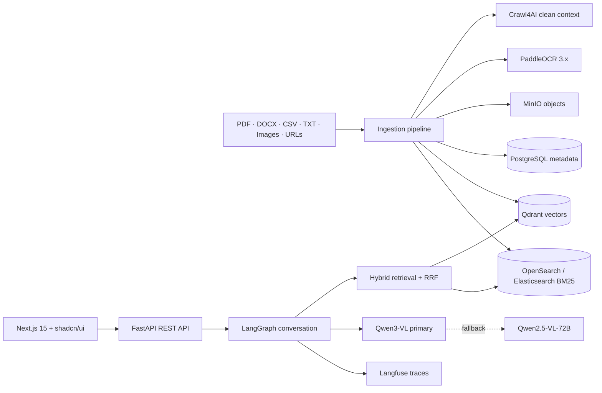

# AI_doc_assistant

A production-shaped demo of a multimodal RAG chatbot for conversational document access, long-document summarization, multi-turn follow-up questions, and wide knowledge search.

## Architecture



The main search path retrieves dense matches from Qdrant and keyword matches from OpenSearch, then combines them with Reciprocal Rank Fusion. Elasticsearch is implemented as a configurable alternative (`SEARCH_PROVIDER=elasticsearch`) and is available through the Compose `elastic` profile.

## What is included

- Responsive Next.js chat workspace with document sources, citations, upload state, and offline demo responses.
- FastAPI endpoints for upload, URL ingestion, hybrid search, chat, document listing, and long-document summarization.
- LangGraph multi-turn workflow: history → retrieval → grounded Qwen answer → persistence.
- PaddleOCR 3.x adapter for scans/images and Crawl4AI for clean web-page ingestion.
- MinIO object storage, PostgreSQL metadata/history, Qdrant vectors, and OpenSearch BM25.
- OpenAI-compatible Qwen client, Qwen3-VL primary and Qwen2.5-VL-72B fallback.
- Optional Langfuse tracing configured entirely by environment variables.
- Docker Compose, health checks, service profiles, and focused unit tests.

## Quick start

1. Create the local environment file:

   ```bash
   cp .env.example .env
   ```

2. Start the standard stack:

   ```bash
   docker compose up --build
   ```

3. Open the app at `http://localhost:3100`, API docs at `http://localhost:8100/docs`, and MinIO Console at `http://localhost:9101`.

The UI works in demo mode before the model server is configured. For real answers, point `QWEN_BASE_URL` at any OpenAI-compatible hosted Qwen endpoint, or start the optional GPU profile:

```bash
docker compose --profile gpu up --build
```

The local Qwen models are large; the GPU profile is deliberately opt-in. A hosted inference endpoint is usually the fastest demo path.

## Test the running stack

From PowerShell, run the included end-to-end smoke test:

```powershell
.\scripts\smoke-test.ps1
```

It checks the frontend, API, MinIO, Qdrant, and OpenSearch; uploads a sample document; waits for indexing; verifies hybrid retrieval; and calls the chat endpoint. Until `QWEN_BASE_URL` points to a working model server, the final chat response intentionally explains that model configuration is still required.

## Optional OCR and Elasticsearch

PaddleOCR is integrated but excluded from the default API image to keep a first build manageable. Enable the full OCR image with:

```bash
INSTALL_OCR=true docker compose build api
docker compose up
```

Crawl4AI is also opt-in because it adds browser automation and a large extraction dependency tree:

```bash
INSTALL_CRAWL=true docker compose build api
docker compose up
```

To use Elasticsearch instead of OpenSearch:

```bash
SEARCH_PROVIDER=elasticsearch ELASTICSEARCH_URL=http://elasticsearch:9200 docker compose --profile elastic up --build
```

## API examples

Upload a document:

```bash
curl -F "files=@report.pdf" http://localhost:8100/api/v1/documents
```

Ask a grounded follow-up question:

```bash
curl -X POST http://localhost:8100/api/v1/chat \
  -H "Content-Type: application/json" \
  -d '{"message":"Summarize the major risks","conversation_id":"your-uuid"}'
```

Ingest a public web page through Crawl4AI:

```bash
curl -X POST http://localhost:8100/api/v1/documents/url \
  -H "Content-Type: application/json" \
  -d '{"url":"https://example.com/report"}'
```

## Development without Docker

Frontend:

```bash
npm install
npm run dev
```

Backend (requires the infrastructure services and Python 3.11):

```bash
python -m venv .venv
.venv/Scripts/pip install -r backend/requirements.txt
uvicorn backend.app.main:app --reload --port 8000
```

## Important production follow-ups

This is a demo foundation, not a finished multi-tenant SaaS. Before production, add identity/RBAC, malware scanning, tenant filters on every retrieval, signed object URLs, durable job queues, migrations, secret management, rate limits, evaluation datasets, and document-level retention/deletion workflows.
